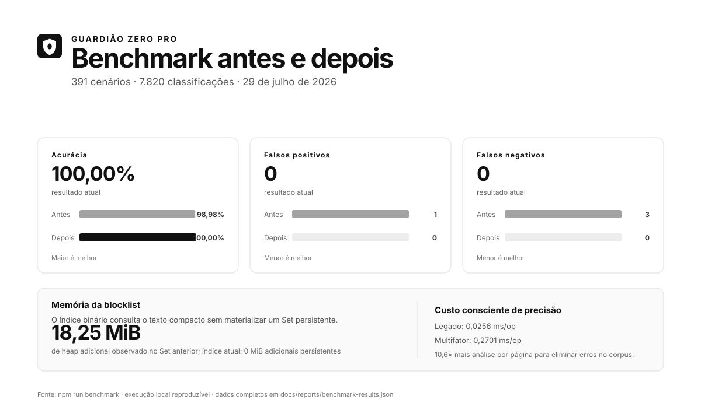

# Guardião Zero Pro

<p>
  
</p>

Extensão Manifest V3 para Firefox e Chromium que reduz a exposição a
plataformas de apostas, anúncios e rastreadores. A classificação é
determinística, multifator e executada localmente. Não há telemetria, conta,
servidor próprio ou envio de conteúdo de navegação.



O gráfico é gerado por `npm run benchmark` a partir dos 391 cenários
determinísticos versionados. Os dados completos, incluindo ambiente e tempos,
ficam em [`docs/reports/benchmark-results.json`](docs/reports/benchmark-results.json).

## Bloqueio de anúncios e rastreadores

O bloqueio de rede é a camada principal e roda antes de qualquer recurso
carregar, via `declarativeNetRequest`. Os rulesets estáticos são **gerados** a
partir de seed lists legíveis em sintaxe Adblock:

```text
src/filters/sources/*.txt   →   tools/build-rules.mjs   →   src/background/rules/*.json
```

A conversão usa exatamente o mesmo parser que valida listas importadas pelo
usuário, então regra embarcada e regra importada passam pelas mesmas recusas de
segurança. Editar cobertura é editar um `.txt`; `npm run build:rules` regenera o
JSON e `npm run lint` falha se os dois divergirem.

Cobertura embarcada atual: 202 regras de anúncio e 132 de rastreamento, cada uma
cobrindo 11 tipos de recurso. `main_frame` fica deliberadamente de fora — o
anúncio já não renderizou, e bloquear navegação de nível superior quebraria
click-through sem ganho.

Isso **não** substitui EasyList. Para cobertura de escala, importe EasyList e
EasyPrivacy em Configurações → Listas de filtros; a lista embarcada cobre
infraestrutura publicitária estável e serve de piso.

### Ocultamento de elementos

O bloqueio de rede impede o recurso de carregar, mas o contêiner do anúncio
continua ocupando espaço — e anúncio nativo nem chega a fazer requisição de
terceiro. A segunda camada oculta esses elementos.

São 52 seletores embarcados, gerados de `src/filters/sources/cosmetic.txt` pelo
mesmo pipeline. O efeito é sempre `display: none`; a lista nunca fornece uma
declaração de estilo. O parser recusa seletor que atinja estrutura da página
(`html`, `body`, `main`, `article`, `:root`, `*`), sintaxe procedural, injeção
de estilo e scriptlet.

A aplicação é **CSS puro, sem `MutationObserver`**: uma regra CSS já vale para
elementos que ainda não existem, então conteúdo dinâmico, infinite scroll e SPA
ficam cobertos sem custo por mutação.

Whitelist, liberação temporária e o toggle de anúncios desligam o ocultamento
com a mesma precedência das demais camadas.

## Recursos

- detecção contextual por score, grupos de evidência e safeguards;
- política local auditável com 28 domínios inequívocos e o sufixo `.bet.br`,
  aplicada por DNR antes do carregamento e pelo classificador como fallback;
- whitelist tipada com prioridade sobre classificação e regras de rede;
- blocklist tipada para domínio, subdomínio, regex, TLD, ASN condicional e
  assinatura;
- rulesets DNR independentes para anúncios e rastreadores;
- importação local do subconjunto seguro de EasyList, EasyPrivacy, AdGuard,
  uBlock Origin, HOSTS e listas personalizadas;
- gerenciamento, pausa, remoção, relatório de rejeições e quota portátil de
  4.900 regras importadas;
- temas claro, escuro ou sistema, accent color, alto contraste, densidade e
  redução de movimento;
- identidade própria Limiar Orbital, composição editorial numerada, Newsreader
  nos títulos, Inter nos controles e ícones próprios empacotados;
- backup e restauração locais;
- política de privacidade navegável dentro da extensão.

## Privacidade

O Guardião Zero Pro não envia, compartilha nem transmite dados do usuário para
o desenvolvedor ou terceiros. Preferências, listas e contadores agregados
permanecem exclusivamente em `storage.local`. Sinais limitados da página,
inclusive em páginas autenticadas, são processados local e transitoriamente
somente para a decisão atual; valores de campos, cookies e storage não são
lidos.

Leia a [Política de Privacidade](PRIVACY.md) e o
[modelo de segurança](docs/SECURITY.md).

## Detecção

O limiar padrão é 120, configurável entre 100 e 180. Cada categoria de
evidência tem um teto; repetir um termo não aumenta indefinidamente a
pontuação. Um bloqueio automático exige:

1. score igual ou superior ao limiar;
2. pelo menos dois grupos positivos independentes;
3. confirmação operacional, confirmação do índice por conteúdo, ou três
   grupos fortes;
4. aprovação do safeguard para contexto jornalístico, educacional ou
   documental.

Nenhuma palavra isolada — inclusive `bet`, `casino` ou `odds` — é suficiente.
Domínios integrados confiáveis, regras pessoais permitidas e liberações
temporárias são avaliados primeiro.

Detalhes: [docs/DETECTION.md](docs/DETECTION.md).

## Listas de filtros

A importação aceita arquivos locais de até 4 MiB. O parser nunca executa o
conteúdo importado e traduz apenas regras de rede representáveis com segurança
por `declarativeNetRequest`. Filtros cosméticos, scriptlets, HTML filtering,
redirect, CSP, alteração de headers e regex arbitrária são recusados e
contabilizados.

As categorias seguem os toggles da extensão:

- Anúncios → `blockAds`;
- Privacidade → `blockTrackers`;
- Apostas → `blockBetting`;
- Personalizada → ativa enquanto a proteção geral estiver ativa.

## Desenvolvimento

Requer Node.js 22 ou superior. Não existem dependências npm de runtime.

```text
npm run lint
npm test
npm run build:rules
npm run build:icons
npm run build:shots
npm run benchmark
npm run test:real
npm run build:firefox
npm run build:chromium
```

O manifesto-fonte usa `background.scripts`, compatível com Firefox. Os builds
são direcionados e têm diretórios separados, de modo que as duas versões podem
ficar carregadas ao mesmo tempo:

- `build:firefox` gera `dist/firefox/` com `background.scripts`;
- `build:chromium` troca essa declaração por `background.service_worker` em
  `dist/chromium/`.

Para testes, carregue sempre a pasta do alvo. Para o AMO, nunca compacte nem
envie a raiz do repositório: ela contém documentação, ferramentas e `.git` que
não pertencem ao add-on.

Para validar e empacotar a submissão Firefox:

```text
npm run package:amo
```

O comando usa `web-ext` 10.6.0 fixado no lockfile, exige zero warnings e grava
em `web-ext-artifacts/` um ZIP com `firefox` no nome. Esse é o único arquivo que
deve ser enviado ao AMO; o comando também grava seu SHA-256 e um manifesto de
release verificável.

## Avaliação

`npm test` executa testes unitários, de integração e centenas de cenários de
regressão determinísticos. Eles não são apresentados como tráfego real.

No benchmark histórico de 29 de julho de 2026, o corpus passou de 98,98% para
100% de acurácia, de 1 para 0 falso positivo e de 3 para 0 falsos negativos.
Na 3.1.2, a base legada de 4,18 MiB deixou de participar do build e foi
substituída por uma política pequena mantida pelo projeto, eliminando sua
leitura no despertar do background. Essas são medições de regressão e decisões
de arquitetura, não uma promessa de precisão na web.

`npm run test:real` acessa somente as URLs públicas declaradas em
`tests/real-world-corpus.json`, descarta respostas indisponíveis ou
intersticiais e registra hash, status e fatores sem salvar o HTML.

Na execução de 29 de julho de 2026:

- 47 URLs reais tentadas;
- 23 respostas utilizáveis e 24 indisponíveis;
- 5 TP, 1 FN, 17 TN e 0 FP;
- precisão positiva de 100%, recall de 83,33% e acurácia de 95,65% no
  subconjunto disponível.

Esses valores descrevem somente aquela execução e não são promessa sobre toda
a web. Consulte os [resultados completos](docs/reports/real-world-results.json)
e o [gráfico gerado](docs/assets/precision-real-world.svg).

## Estrutura

```text
assets/                  marca, ícones, fontes Inter/Newsreader e licenças OFL
src/filters/sources/     seed lists de anúncios e rastreadores (sintaxe Adblock)
src/background/rules/    rulesets DNR gerados — não editar à mão
src/background/          estado, políticas, DNR e índice local
src/content/             coleta limitada e orquestração da análise
src/shared/detection/    constantes, score e decisão multifator
src/shared/filters/      parser conservador de listas
src/shared/lists/        whitelist e blocklist tipadas
src/shared/messaging/    schemas e validação de mensagens
src/{popup,options}/     controles principais e personalização
src/{blocked,help}/      bloqueio e ajuda
src/{diagnostics,privacy}/ diagnóstico e política navegável
tests/                   unidade, integração, regressão e corpus real
tools/                   validação, benchmark, build, avaliação e pacote AMO
docs/                    arquitetura, segurança e relatórios
```

As regras de marca, tipografia, iconografia, linguagem e movimento estão
documentadas em [docs/BRAND_SYSTEM.md](docs/BRAND_SYSTEM.md).

Os arquivos de marca seguem o mesmo princípio dos rulesets — são **gerados**, não
editados:

```text
tools/make-icons.mjs   →   assets/brand/*.svg + assets/icons/*.png + docs/assets/brand/*
```

Uma única geometria produz o SVG e cada PNG, com rasterizador próprio e sem
dependências. `npm run build:icons` regenera tudo e `npm run lint` falha se algum
arquivo versionado divergir da geometria.

## Permissões

- `storage`: dados funcionais locais;
- `declarativeNetRequest`: bloqueio de rede;
- `webNavigation`: aplicação antecipada de políticas explícitas;
- hosts HTTP(S): processamento local de sinais limitados necessários à função
  principal.

A extensão não solicita `declarativeNetRequestFeedback`, cookies, histórico,
downloads, identidade ou acesso remoto a código.

## Licenças e publicação

O código e a política pequena de domínios mantida pelo projeto estão sob MIT;
Inter e Newsreader estão sob OFL-1.1. A lista legada sem proveniência é
explicitamente excluída de `dist/` e do ZIP do AMO. Consulte
[THIRD_PARTY_NOTICES.md](THIRD_PARTY_NOTICES.md) antes de redistribuir ou criar
um pacote de código-fonte.

O checklist de submissão está em
[docs/AMO_SUBMISSION.md](docs/AMO_SUBMISSION.md).
